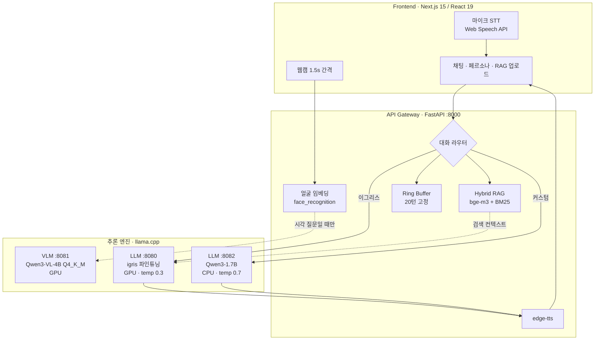
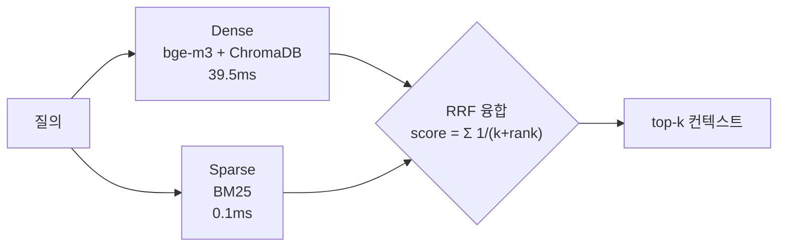

# SmolFusion — 실시간 멀티모달 HRI 아키텍처

경량 VLM과 파인튜닝 LLM을 동시 구동하여 실시간 인간-로봇 상호작용(HRI)을 구현한 시스템.
Jetson 온디바이스 환경에서 출발해 브라우저 기반 웹 데모까지 확장하였다.

**[Live Demo — hera-hri.vercel.app](https://hera-hri.vercel.app)** — 프론트엔드는 Vercel에 상주하며,
추론 백엔드(GPU)는 개발 PC에서 Cloudflare Tunnel을 통해 연결된다.
백엔드 미가동 시 오프라인 배너가 표시된다.

> **핵심 관점** — 실시간 HRI의 병목은 개별 모델 성능이 아니라 **실행 구조**에 있다.
> 동일한 모델이라도 서비스 분리 방식과 호출 시점에 따라 종단 지연과 안정성이 달라진다.

**실측 요약** (RTX 3070 8GB / 아래 [측정](#측정) 참조)

| 지표 | 값 |
|---|---|
| 종단 응답 지연 (RAG 포함) | **0.19s** (중앙값, n=5) |
| 룰 기반 응답 (LLM 미호출) | **0.003s** |
| BM25 융합 추가 비용 | **+0.1ms** (Dense 39.5ms 대비 무시 가능) |
| 양자화 메모리 절감 | **3.21GB → 1.03GB** (FP16 → Q4_K_M, -68%) |
| VLM+LLM 동시 상주 VRAM | **5.9GB / 8GB** |
| 세션 메모리 상한 | **20턴 고정** (500턴 주입 후에도 20턴 유지) |

---

## 왜 만들었나

로봇이 사람과 상호작용하려면 시각 처리(카메라)와 대화 생성이 동시에 수행되어야 한다.
문제는 두 경로의 처리 시간이 상이하다는 점이다. VLM 추론이 완료될 때까지 대화 응답이
대기하면 실시간 상호작용이 성립하지 않는다.

기존 접근은 대부분 상위 모델로의 교체에 집중한다. 그러나 Jetson과 같이 자원이 고정된
환경에서는 해당 선택지가 존재하지 않는다. 이에 **모델 구성을 고정한 채 실행 구조만을
변경하여** 실시간성을 어디까지 확보할 수 있는지 검증하였다.

본 저장소는 그 과정에서 도출된 세 가지 결과물로 구성된다.

| | 무엇 | VLM | 어디에 |
|---|---|---|---|
| **웹 데모** | 브라우저에서 쓰는 풀스택 HRI (카메라·음성·RAG·페르소나) | Qwen3-VL-4B | [`webapp/`](webapp/) |
| **온디바이스** | Jetson AGX Orin / NX 단독 실행 (오프라인 동작) | SmolVLM-500M | [`nx/`](nx/), [`vlm_server/`](vlm_server/) |
| **파인튜닝** | Qwen3-1.7B QLoRA 페르소나 학습 | — | [Qwen3-Persona-Trainer](https://github.com/Diucord/Qwen3-Persona-Trainer) |

세 갈래 모두 llama.cpp(GGUF) 위에서 동작한다. 추론 엔진과 API 계약을 고정한 채
하드웨어 특성에 맞는 모델만 교체하는 구조가 본 프로젝트의 검증 대상이다.

---

## 아키텍처

추론 엔진을 독립 프로세스로 분리하고 FastAPI 게이트웨이가 오케스트레이션한다.
특정 모델의 지연이 다른 경로를 블로킹하지 않도록 설계하였다.



**설계 결정**

- **프로세스 분리** — VLM(4B)과 LLM(1.7B)을 단일 프로세스에 로드할 경우 8GB VRAM 환경에서
  OOM이 발생한다. 분리 후 **VRAM 5.9GB로 동시 상주**가 가능하며, 범용 LLM을 CPU(`-ngl 0`)로
  전환해 여유를 확보하였다.
- **LLM 이중화** — 파인튜닝 페르소나는 정체성 일관성을 위해 `temp 0.3`, 범용 페르소나는
  표현 다양성을 위해 `temp 0.7`이 요구된다. 단일 서버로는 상충하는 두 요구를 만족시킬 수 없다.
- **VLM 조건부 호출** — 시각 정보가 필요한 질의에서만 호출한다. 인사말에 카메라 분석을
  개입시키는 것은 지연만 증가시킨다.
- **룰 우선 라우팅** — 정형 질의는 **0.003초**에 처리되나 LLM을 경유하면 0.19초가 소요된다.
  63배의 지연 차이를 감수할 이유가 없으며, 동시에 정체성 답변을 고정해 환각을 차단한다.

자세한 내용: [`webapp/ARCHITECTURE.md`](webapp/ARCHITECTURE.md)

### 하드웨어 추상화 — 설정 교체만으로 환경 전환

코드 분기 대신 **프로파일 파일로 실행 환경을 교체**한다
([`app.nx.yaml`](nx/app/config/app.nx.yaml) / [`app.5080.yaml`](nx/app/config/app.5080.yaml)).
동일한 llama.cpp, 동일한 HTTP 계약, 동일한 파이프라인을 유지한 채 아래 값만 교체된다.

| | Jetson Orin NX | RTX 3070 (webapp) |
|---|---|---|
| VLM | SmolVLM-500M Q8 (0.41GB) | Qwen3-VL-4B Q4_K_M (2.33GB) |
| LLM | qwen3-igris-1.7b Q4_K_M (1.03GB) | 동일 |
| LLM 오프로딩 | `-ngl 0` (CPU) | `-ngl 99` (GPU) |
| 컨텍스트 | 1024 | 4096 |
| TTS | piper (오프라인) | edge-tts |
| 분석 주기 | 1.5s + 모션 감지 스킵 | 1.5s |

Jetson 환경에서 VLM을 500M으로 선택한 것은 정확도를 포기한 결과가 아니라
**지연 한계(latency budget)를 우선한 판단**이다. 응답이 수 초 지연되면 실시간
상호작용이 성립하지 않기 때문이다.

프로젝트명의 *Smol*은 이 지점에서 비롯되었다. 출발점이 **SmolVLM-500M**이었고,
가장 제약이 강한 환경에서 먼저 설계하였기에 4B로 확장할 때 **아키텍처는 유지한 채
설정만 교체**하면 충분하였다. 반대 순서(대형 모델에서 경량화)로 접근했다면
구조 재설계가 불가피했을 것이다.

---

## Hybrid RAG — 환각 차단 검증

경량 LLM(1.7B)은 학습하지 않은 정보를 **높은 확신도로 생성**한다. 추상적 위험이 아니라
재현 가능한 문제다.

로봇 사양서를 업로드한 후 동일 질의를 RAG 유무만 변경하여 측정한 결과는 다음과 같다.

| 질문 | RAG **OFF** | RAG **ON** | 문서 실제 값 |
|---|---|---|---|
| 서비스 센터 번호? | `02-485-9311` | `1588-0000` | 1588-0000 |
| 배터리 용량? | `1000mAh, 충전 1시간` | `5200mAh, 4시간` | 5200mAh, 4시간 |
| 보증 기간? | — | `24개월` | 24개월 |

RAG 미적용 시 존재하지 않는 값을 생성하며 *"이전 대화 내용을 참고해 주세요"* 라는
허위 근거까지 부가한다. 검색 증강이 이러한 환각을 구조적으로 차단한다.

### 검색 구조



- **Dense 단독** — `5200mAh`, `Qwen3-1.7B` 등 고유 수치·모델명 매칭에 취약하다.
- **Sparse 단독** — "로봇이 하는 일" ↔ "주요 임무" 같은 동의 표현을 연결하지 못한다.
- **RRF(Reciprocal Rank Fusion)** — 두 검색기의 점수는 스케일이 상이하여 직접 합산이
  불가능하다. RRF는 순위만을 사용하므로 정규화 없이 융합할 수 있다 (k=60).

**BM25 추가 비용은 0.1ms에 불과하다.** Dense 임베딩이 39.5ms를 소비하는 것을 고려하면
사실상 무비용이며, 하이브리드 구성을 채택하지 않을 이유가 없다는 것이 핵심 판단이다.

**한국어 BM25의 제약** — 공백 분리 방식을 적용하면 `로봇은`/`로봇이`/`로봇의`가 전부
상이한 토큰으로 처리되어 매칭이 완전히 실패한다(실측: 공통 토큰 0개). 형태소 분석기
의존성을 추가하지 않고 해결하기 위해 문자 bigram과 어절 원형을 함께 색인하여
조사 변형을 흡수하였다.

구현: [`webapp/backend/rag/store.py`](webapp/backend/rag/store.py)

---

## 측정

측정 환경: RTX 3070 8GB / Windows / conda `smolfusion`. 상기 서버 3개 구동 상태에서 측정하였다.

**종단 지연** — `/chat` 요청부터 응답까지 (n=5, 세션 격리)

| 시나리오 | 중앙값 | 평균 | 경로 |
|---|---|---|---|
| 룰 기반 ("너는 누구야?") | **0.003s** | 0.003s | LLM 미호출 |
| 파인튜닝 LLM + RAG | **0.19s** | 0.23s | 검색 → LLM |
| 파인튜닝 LLM (RAG 없이) | **0.17s** | 0.19s | LLM 직행 |

RAG 적용 시 지연 증가는 +0.02s에 그친다. 하이브리드 검색이 종단 응답성을 저해하지 않음을 확인하였다.

**검색 지연 분해** (n=20, 중앙값, LLM 제외)

| 단계 | 지연 |
|---|---|
| Dense (bge-m3 + ChromaDB) | 39.5ms |
| Sparse (BM25) | 0.1ms |
| Hybrid (Dense + BM25 + RRF) | 36.8ms |

**양자화 효과** (동일 파인튜닝 모델)

| 포맷 | 크기 | 절감 |
|---|---|---|
| FP16 (`qwen3-igris-1.7b.gguf`) | 3.21GB | — |
| Q4_K_M (`qwen3-igris-1.7b.Q4_K_M.gguf`) | 1.03GB | **-68%** |

**메모리 안정성** — Ring Buffer(`deque(maxlen=20)`)에 500턴을 주입해도 보관 턴 수는 20으로 유지된다.
장시간 대화에서 컨텍스트가 무한 증가하지 않음을 검증하였다. [`core/memory.py`](webapp/backend/core/memory.py)

> 재현: [`vlm_server/agx/test_performance_agx.py`](vlm_server/agx/test_performance_agx.py),
> [`vlm_server/agx/performance_monitor.py`](vlm_server/agx/performance_monitor.py)

---

## 주요 기능

- **실시간 시각 분석** — Qwen3-VL-4B + face_recognition (나이/성별/표정/인원/장면)
- **자동 인사** — 새 사람 감지 시 연령·성별 맞춤 인사
- **음성 대화** — Web Speech API(STT) + edge-tts(TTS)
- **페르소나** — 이그리스 C(파인튜닝) / 커스텀(슬라이더) / 사용자 생성
- **Hybrid RAG** — 문서 업로드 후 검색 증강, 페르소나별 지식베이스 분리
- **세션 관리** — Ring Buffer 기반 고정 길이 컨텍스트
- **동일인 판별** — 얼굴 임베딩 코사인 유사도로 세션 유지/분리

---

## 실행

전제: conda 환경 `smolfusion` (Python 3.10), CUDA GPU 8GB+, Node 18+

```powershell
# 1) llama.cpp 서버 3개
$L = "webapp\llamacpp\llama-server.exe"; $M = "webapp\models"
& $L -m "$M\Qwen3VL-4B-Instruct-Q4_K_M.gguf" --mmproj "$M\mmproj-Qwen3VL-4B-Instruct-Q8_0.gguf" -ngl 99 -c 4096 --port 8081
& $L -m "nx\models\qwen3-igris-1.7b.Q4_K_M.gguf" -ngl 99 -c 4096 --port 8080 --alias qwen3-igris-1.7b
& $L -m "$M\Qwen3-1.7B-Q8_0.gguf" -ngl 0 -c 4096 -t 8 --port 8082 --alias Qwen3-1.7B-Q8_0.gguf

# 2) 백엔드
conda activate smolfusion
cd webapp\backend && pip install -r requirements.txt && python app.py

# 3) 프론트엔드
cd webapp\frontend && npm install && npm run dev   # localhost:3000
```

모델 다운로드 및 상세 설정: [`webapp/README.md`](webapp/README.md)
배포(Vercel + Cloudflare Tunnel): [`webapp/DEPLOY.md`](webapp/DEPLOY.md)

---

## 실행 환경 비교

동일 아키텍처를 유지한 채 실행 위치와 추론 엔진만 교체하여 4가지 시나리오를 검증하였다.

| | 실행 위치 | 추론 엔진 | 오프라인 | 개인정보 |
|---|---|---|---|---|
| Case 1 | RTX 서버 | GPU FastAPI | 불가 | 서버 전송 |
| Case 2 | RTX 서버 | llama.cpp | 불가 | 서버 전송 |
| Case 3 | Jetson → 서버 | 원격 호출 | 불가 | 서버 전송 |
| Case 4 | Jetson 단독 | llama.cpp | **가능** | **로컬 처리** |

서버 경유 방식은 성능을 확보하는 대신 네트워크 의존성을 수반한다. 온디바이스 방식은
응답 품질을 일부 양보하는 대신 오프라인 동작과 프라이버시를 확보한다.

**원격 서버와 온디바이스는 대체 관계가 아니라 요구사항에 따른 선택지다.**
연구·데모 환경에서는 서버 구성이, 실제 서비스 로봇에서는 온디바이스 구성이 현실적이다.

---

## 저장소 구조

```
├── webapp/            # 웹 데모 (현재 주 개발 — Next.js + FastAPI)
│   ├── backend/       #   FastAPI 게이트웨이, Hybrid RAG, Vision, TTS
│   ├── frontend/      #   Next.js 15 UI
│   ├── scripts/       #   데모 기동 자동화 (PowerShell)
│   ├── PORTFOLIO.md       # 설계 결정 · 실측 근거 · 기술적 기여 (메인)
│   ├── ARCHITECTURE.md    # 구현 상세
│   ├── JETSON_PORTING.md  # 온디바이스 이식 최적화 기록
│   └── DEPLOY.md          # 배포 (Vercel + Cloudflare Tunnel)
│
├── on-device/         # Jetson 온디바이스 (정리본 + llama.cpp CUDA 빌드 가이드)
│   └── app/llm_chat_rag.py    # 온디바이스 RAG 경로
├── server-based/      # 서버 기반 실행 (정리본)
│   └── scripts/rag_engine.py  # FAISS + BM25 초기 하이브리드 구현
│
├── nx/                # Jetson Orin NX 원본 작업본 (프로파일 YAML 포함)
├── vlm_server/        # Jetson AGX Orin 원본 + 성능 측정 스크립트
└── robros/            # 실험 기록 · 스크린샷 · GGUF 변환 도구
```

> `on-device/` · `server-based/`는 발표용으로 정리한 스냅샷이며,
> `nx/` · `vlm_server/`는 실험 이력이 보존된 원본 작업본이다.
> 웹 데모(`webapp/`)는 해당 계보를 이어받아 재설계하였다.

### RAG 구현이 두 갈래인 이유

| 위치 | 구성 | 임베딩 | 한계 / 개선 |
|---|---|---|---|
| `server-based/scripts/rag_engine.py` | FAISS + BM25 (set union) | `paraphrase-albert-small-v2` | 영어 전용 모델 → **한국어 질의에서 Dense 검색이 사실상 무작위** |
| `webapp/backend/rag/store.py` | ChromaDB + BM25 (**RRF**) | **bge-m3** (멀티링구얼) | 한국어 대응, 순위 기반 융합, PDF 업로드·페르소나별 격리 |

초기 하이브리드 구성은 임베딩 모델이 한국어를 지원하지 않아 HRI 환경에 적용할 수 없었다.
멀티링구얼 임베딩으로 교체하고, 단순 합집합 대신 RRF로 융합하도록 재설계하였다.

## 기술 스택

**추론** `llama.cpp` `GGUF (Q4_K_M/Q8)` `CUDA` `Qwen3-VL-4B` `SmolVLM-500M` `Qwen3-1.7B` `QLoRA`
**백엔드** `Python 3.10` `FastAPI` `ChromaDB` `bge-m3` `BM25` `face_recognition` `edge-tts` `piper`
**프론트** `Next.js 15` `React 19` `TypeScript` `Web Speech API`

---

## 관련 저장소

- [Qwen3-Persona-Trainer](https://github.com/Diucord/Qwen3-Persona-Trainer) — 이 프로젝트에 쓰인 페르소나 LLM의 QLoRA 파인튜닝 파이프라인
