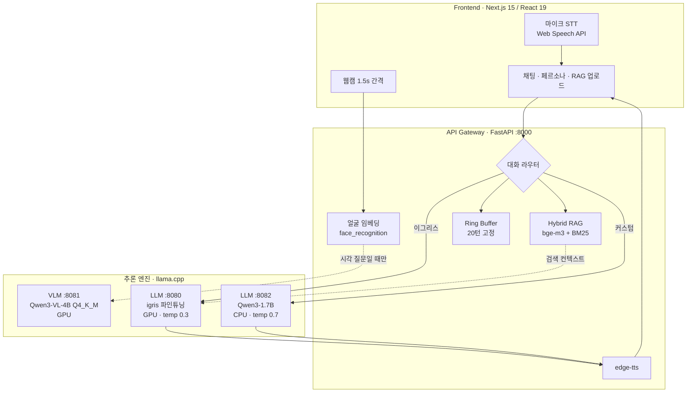
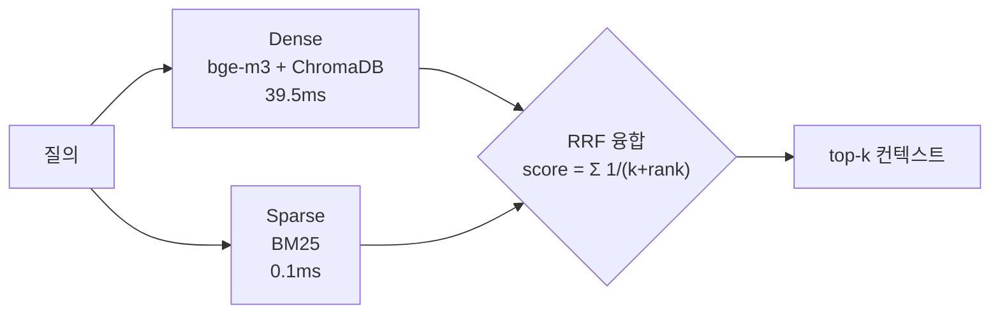

# SmolFusion — 실시간 멀티모달 HRI 아키텍처

경량 VLM과 파인튜닝 LLM을 동시 구동해 실시간 인간-로봇 상호작용(HRI)을 구현한 시스템.
Jetson 온디바이스에서 출발해, 브라우저에서 바로 체험 가능한 웹 데모까지 확장했다.

**[Live Demo — hera-hri.vercel.app](https://hera-hri.vercel.app)** — 프론트는 Vercel에 상주하고,
추론 백엔드(GPU)는 개발 PC에서 Cloudflare Tunnel로 연결된다.
백엔드가 꺼져 있으면 오프라인 배너가 표시된다.

> **핵심 관점** — 실시간 HRI의 병목은 개별 모델 성능이 아니라 **실행 구조**다.
> 같은 모델이라도 서비스를 어떻게 쪼개고 언제 호출하느냐에 따라 종단 지연과 안정성이 달라진다.

**실측 요약** (RTX 3070 8GB / 아래 [측정](#측정) 참조)

| 지표 | 값 |
|---|---|
| 종단 응답 지연 (RAG 포함) | **0.19s** (중앙값, n=5) |
| 룰 기반 응답 (LLM 미호출) | **0.003s** |
| BM25 융합 추가 비용 | **+0.1ms** (Dense 39.5ms 대비 무시 가능) |
| 양자화 메모리 절감 | **3.21GB → 1.03GB** (FP16 → Q4_K_M, -68%) |
| VLM+LLM 동시 상주 VRAM | **5.9GB / 8GB** |
| 세션 메모리 상한 | **20턴 고정** (500턴 주입 후에도 20턴 유지) |

---

## 왜 만들었나

로봇이 사람과 대화하려면 **보는 것**(카메라)과 **말하는 것**(대화)이 동시에 돌아야 한다.
문제는 둘의 처리 시간이 전혀 다르다는 점이다. VLM 추론이 끝날 때까지 대화가 멈추면
로봇은 "느린 로봇"이 된다.

기존 접근은 대부분 모델을 더 좋은 것으로 바꾸는 데 집중한다. 하지만 Jetson처럼
자원이 고정된 환경에서는 그 선택지가 없다. 그래서 **모델은 그대로 두고 구조만 바꿔서**
어디까지 갈 수 있는지 확인해 보기로 했다.

이 저장소는 그 과정에서 나온 세 가지 결과물이다.

| | 무엇 | VLM | 어디에 |
|---|---|---|---|
| **웹 데모** | 브라우저에서 쓰는 풀스택 HRI (카메라·음성·RAG·페르소나) | Qwen3-VL-4B | [`webapp/`](webapp/) |
| **온디바이스** | Jetson AGX Orin / NX 단독 실행 (오프라인 동작) | SmolVLM-500M | [`nx/`](nx/), [`vlm_server/`](vlm_server/) |
| **파인튜닝** | Qwen3-1.7B QLoRA 페르소나 학습 | — | [Qwen3-Persona-Trainer](https://github.com/Diucord/Qwen3-Persona-Trainer) |

세 갈래 모두 llama.cpp(GGUF) 위에서 돈다. 추론 엔진과 API 계약을 고정한 채
하드웨어에 맞는 모델만 갈아끼우는 것 — 이게 이 프로젝트가 검증하려는 구조다.

---

## 아키텍처

추론 엔진을 독립 프로세스로 분리하고 FastAPI 게이트웨이로 오케스트레이션한다.
한 모델의 지연이 다른 경로를 막지 않는다.



**설계 결정**

- **왜 프로세스를 나눴나** — VLM(4B)과 LLM(1.7B)을 한 프로세스에 올리면 8GB VRAM에서 OOM이 난다.
  분리하니 **5.9GB로 둘 다 상주**하고, 일반 LLM만 CPU(`-ngl 0`)로 밀어 여유를 만들었다.
- **왜 LLM이 두 개인가** — 파인튜닝된 이그리스는 정체성 일관성이 필요해 `temp 0.3`,
  범용 페르소나는 다양성이 필요해 `temp 0.7`. 같은 서버로는 둘을 만족시킬 수 없다.
- **왜 VLM을 매 턴 부르지 않나** — 시각 정보가 필요한 질문에서만 호출한다.
  "안녕"에 카메라를 켜는 건 지연만 늘린다.
- **왜 룰이 LLM보다 앞에 있나** — "너는 누구야?" 같은 정형 질의는 **0.003s에 끝난다**.
  LLM을 태우면 0.19s. 60배 차이를 공짜로 버릴 이유가 없다.

자세한 내용: [`webapp/ARCHITECTURE.md`](webapp/ARCHITECTURE.md)

### 하드웨어가 바뀌면 설정만 바뀐다

코드 분기 대신 **프로파일 파일로 환경을 교체**한다
([`app.nx.yaml`](nx/app/config/app.nx.yaml) / [`app.5080.yaml`](nx/app/config/app.5080.yaml)).
같은 llama.cpp, 같은 HTTP 계약, 같은 파이프라인 — 바뀌는 건 아래 값들뿐이다.

| | Jetson Orin NX | RTX 3070 (webapp) |
|---|---|---|
| VLM | SmolVLM-500M Q8 (0.41GB) | Qwen3-VL-4B Q4_K_M (2.33GB) |
| LLM | qwen3-igris-1.7b Q4_K_M (1.03GB) | 동일 |
| LLM 오프로딩 | `-ngl 0` (CPU) | `-ngl 99` (GPU) |
| 컨텍스트 | 1024 | 4096 |
| TTS | piper (오프라인) | edge-tts |
| 분석 주기 | 1.5s + 모션 감지 스킵 | 1.5s |

Jetson에서 VLM을 500M으로 낮춘 건 정확도를 포기해서가 아니라 **지연 한계(latency budget)**
때문이다. 로봇이 2초 뒤에 반응하면 그건 대화가 아니다.

프로젝트 이름의 *Smol*은 여기서 왔다. 시작이 **SmolVLM-500M**이었고, 가장 빡빡한 제약 위에서
먼저 설계했기 때문에 4B로 올릴 때 **아키텍처는 그대로 두고 설정만 바꾸면 됐다.**
반대 방향(큰 모델부터 경량화)이었다면 구조를 다시 짰어야 했다.

---

## Hybrid RAG — 환각이 실제로 어떻게 잡히는가

경량 LLM(1.7B)은 모르는 걸 **자신 있게 지어낸다**. 추상적 위험이 아니라 재현되는 문제다.

로봇 사양서를 업로드하고 같은 질문을 RAG 유무만 바꿔 던진 결과:

| 질문 | RAG **OFF** | RAG **ON** | 문서 실제 값 |
|---|---|---|---|
| 서비스 센터 번호? | `02-485-9311` | `1588-0000` | 1588-0000 |
| 배터리 용량? | `1000mAh, 충전 1시간` | `5200mAh, 4시간` | 5200mAh, 4시간 |
| 보증 기간? | — | `24개월` | 24개월 |

RAG를 끄면 존재하지 않는 값을 만들어내며 *"이전 대화 내용을 참고해 주세요"* 라는
근거까지 덧붙인다. 검색 증강이 이 환각을 차단한다.

### 검색 구조



- **Dense만 쓰면** `5200mAh`, `Qwen3-1.7B` 같은 고유 수치·모델명을 놓친다.
- **Sparse만 쓰면** "로봇이 하는 일" ↔ "주요 임무" 같은 동의 표현을 못 잇는다.
- **RRF(Reciprocal Rank Fusion)** — 두 검색기의 점수는 스케일이 달라 직접 더할 수 없다.
  순위만 사용해 정규화 없이 융합한다 (k=60).

**BM25 추가 비용은 0.1ms.** Dense 임베딩이 39.5ms를 쓰는 옆에서 사실상 공짜다.
하이브리드를 안 쓸 이유가 없다.

**한국어 BM25의 함정** — 공백 분리를 쓰면 `로봇은`/`로봇이`/`로봇의`가 전부 다른 토큰이 되어
매칭이 완전히 실패한다 (실측: 공통 토큰 0개). 형태소 분석기 의존성 없이 해결하려고
문자 bigram + 어절 원형을 함께 색인해 조사 변형을 흡수했다.

구현: [`webapp/backend/rag/store.py`](webapp/backend/rag/store.py)

---

## 측정

RTX 3070 8GB / Windows / conda `smolfusion`. 위 서버 3개 구동 상태에서 측정.

**종단 지연** — `/chat` 요청부터 응답까지 (n=5, 세션 격리)

| 시나리오 | 중앙값 | 평균 | 경로 |
|---|---|---|---|
| 룰 기반 ("너는 누구야?") | **0.003s** | 0.003s | LLM 미호출 |
| 파인튜닝 LLM + RAG | **0.19s** | 0.23s | 검색 → LLM |
| 파인튜닝 LLM (RAG 없이) | **0.17s** | 0.19s | LLM 직행 |

RAG를 켜도 지연은 +0.02s. 하이브리드 검색이 종단 응답성을 해치지 않는다.

**검색 지연 분해** (n=20, 중앙값, LLM 제외)

| 단계 | 지연 |
|---|---|
| Dense (bge-m3 + ChromaDB) | 39.5ms |
| Sparse (BM25) | 0.1ms |
| Hybrid (Dense + BM25 + RRF) | 36.8ms |

**양자화 효과** (동일 파인튜닝 모델)

| 포맷 | 크기 | 절감 |
|---|---|---|
| FP16 (`qwen3-igris-1.7b.gguf`) | 3.21GB | — |
| Q4_K_M (`qwen3-igris-1.7b.Q4_K_M.gguf`) | 1.03GB | **-68%** |

**메모리 안정성** — Ring Buffer(`deque(maxlen=20)`)에 500턴을 주입해도 20턴만 유지.
장시간 대화에서 컨텍스트가 무한 증가하지 않는다. [`core/memory.py`](webapp/backend/core/memory.py)

> 재현: [`vlm_server/agx/test_performance_agx.py`](vlm_server/agx/test_performance_agx.py),
> [`vlm_server/agx/performance_monitor.py`](vlm_server/agx/performance_monitor.py)

---

## 주요 기능

- **실시간 시각 분석** — Qwen3-VL-4B + face_recognition (나이/성별/표정/인원/장면)
- **자동 인사** — 새 사람 감지 시 연령·성별 맞춤 인사
- **음성 대화** — Web Speech API(STT) + edge-tts(TTS)
- **페르소나** — 이그리스 C(파인튜닝) / 커스텀(슬라이더) / 사용자 생성
- **Hybrid RAG** — 문서 업로드 후 검색 증강, 페르소나별 지식베이스 분리
- **세션 관리** — Ring Buffer 기반 고정 길이 컨텍스트
- **동일인 판별** — 얼굴 임베딩 코사인 유사도로 세션 유지/분리

---

## 실행

전제: conda 환경 `smolfusion` (Python 3.10), CUDA GPU 8GB+, Node 18+

```powershell
# 1) llama.cpp 서버 3개
$L = "webapp\llamacpp\llama-server.exe"; $M = "webapp\models"
& $L -m "$M\Qwen3VL-4B-Instruct-Q4_K_M.gguf" --mmproj "$M\mmproj-Qwen3VL-4B-Instruct-Q8_0.gguf" -ngl 99 -c 4096 --port 8081
& $L -m "nx\models\qwen3-igris-1.7b.Q4_K_M.gguf" -ngl 99 -c 4096 --port 8080 --alias qwen3-igris-1.7b
& $L -m "$M\Qwen3-1.7B-Q8_0.gguf" -ngl 0 -c 4096 -t 8 --port 8082 --alias Qwen3-1.7B-Q8_0.gguf

# 2) 백엔드
conda activate smolfusion
cd webapp\backend && pip install -r requirements.txt && python app.py

# 3) 프론트엔드
cd webapp\frontend && npm install && npm run dev   # localhost:3000
```

모델 다운로드 및 상세 설정: [`webapp/README.md`](webapp/README.md)
배포(Vercel + Cloudflare Tunnel): [`webapp/DEPLOY.md`](webapp/DEPLOY.md)

---

## 실행 환경 비교

동일 아키텍처를 유지한 채 실행 위치와 추론 엔진만 교체하며 4가지 시나리오를 검증했다.

| | 실행 위치 | 추론 엔진 | 오프라인 | 개인정보 |
|---|---|---|---|---|
| Case 1 | RTX 서버 | GPU FastAPI | 불가 | 서버 전송 |
| Case 2 | RTX 서버 | llama.cpp | 불가 | 서버 전송 |
| Case 3 | Jetson → 서버 | 원격 호출 | 불가 | 서버 전송 |
| Case 4 | Jetson 단독 | llama.cpp | **가능** | **로컬 처리** |

서버 경유는 성능을 얻고 네트워크 의존을 진다. 온디바이스는 응답 품질을 일부 내주고
오프라인 동작과 프라이버시를 얻는다.

**원격 서버와 온디바이스는 대체 관계가 아니라 상황별 선택지다.**
연구·데모는 서버가, 실제 서비스 로봇은 온디바이스가 현실적이다.

---

## 저장소 구조

```
├── webapp/            # 웹 데모 (현재 주 개발 — Next.js + FastAPI)
│   ├── backend/       #   FastAPI 게이트웨이, Hybrid RAG, Vision, TTS
│   ├── frontend/      #   Next.js 15 UI
│   ├── scripts/       #   데모 기동 자동화 (PowerShell)
│   ├── ARCHITECTURE.md    # 구현 상세
│   ├── PORTFOLIO.md       # 설계 결정 · 실측 근거
│   ├── JETSON_PORTING.md  # 온디바이스 이식 최적화 기록
│   ├── RESUME_FINAL.md    # 포트폴리오 완성본 (검증 완료)
│   ├── RESUME_PATCH.md    # 검증 과정 · 삭제 사유
│   └── DEPLOY.md          # 배포 (Vercel + Cloudflare Tunnel)
│
├── on-device/         # Jetson 온디바이스 (정리본 + llama.cpp CUDA 빌드 가이드)
│   └── app/llm_chat_rag.py    # 온디바이스 RAG 경로
├── server-based/      # 서버 기반 실행 (정리본)
│   └── scripts/rag_engine.py  # FAISS + BM25 초기 하이브리드 구현
│
├── nx/                # Jetson Orin NX 원본 작업본 (프로파일 YAML 포함)
├── vlm_server/        # Jetson AGX Orin 원본 + 성능 측정 스크립트
└── robros/            # 실험 기록 · 스크린샷 · GGUF 변환 도구
```

> `on-device/` · `server-based/`는 발표용으로 정리한 스냅샷,
> `nx/` · `vlm_server/`는 실험이 그대로 남아 있는 원본 작업본이다.
> 웹 데모(`webapp/`)는 이 계보를 이어받아 재설계했다.

### RAG 구현이 두 갈래인 이유

| 위치 | 구성 | 임베딩 | 한계 / 개선 |
|---|---|---|---|
| `server-based/scripts/rag_engine.py` | FAISS + BM25 (set union) | `paraphrase-albert-small-v2` | 영어 전용 모델 → **한국어 질의에서 Dense 검색이 사실상 무작위** |
| `webapp/backend/rag/store.py` | ChromaDB + BM25 (**RRF**) | **bge-m3** (멀티링구얼) | 한국어 대응, 순위 기반 융합, PDF 업로드·페르소나별 격리 |

초기 하이브리드는 임베딩 모델이 한국어를 지원하지 않아 HRI 환경에서 쓸 수 없었다.
멀티링구얼 임베딩으로 교체하고, 단순 합집합 대신 RRF로 융합하도록 재설계했다.

## 기술 스택

**추론** `llama.cpp` `GGUF (Q4_K_M/Q8)` `CUDA` `Qwen3-VL-4B` `SmolVLM-500M` `Qwen3-1.7B` `QLoRA`
**백엔드** `Python 3.10` `FastAPI` `ChromaDB` `bge-m3` `BM25` `face_recognition` `edge-tts` `piper`
**프론트** `Next.js 15` `React 19` `TypeScript` `Web Speech API`

---

## 관련 저장소

- [Qwen3-Persona-Trainer](https://github.com/Diucord/Qwen3-Persona-Trainer) — 이 프로젝트에 쓰인 페르소나 LLM의 QLoRA 파인튜닝 파이프라인
