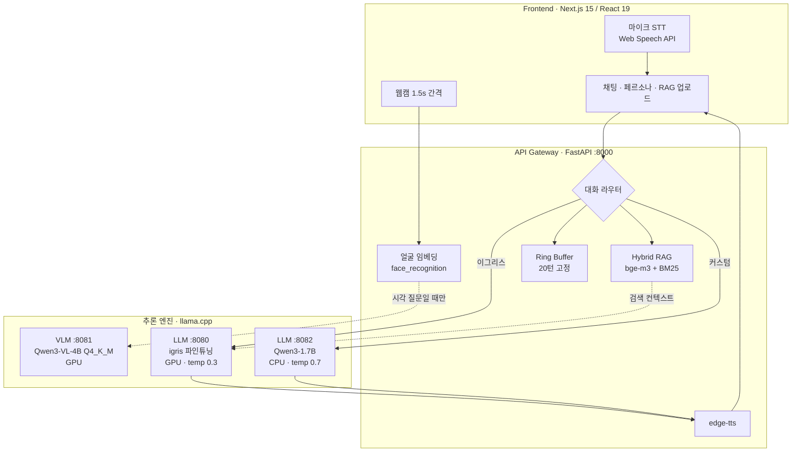
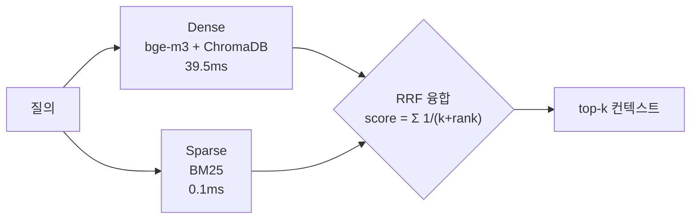
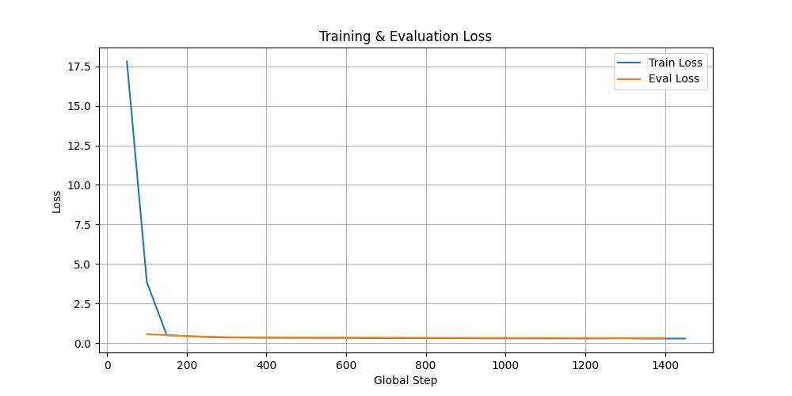

# SmolFusion / Hera — 포트폴리오

> 이력서·경력기술서에 옮겨 적기 위한 원본.
> **모든 서술은 저장소 코드로 검증했고, 모든 수치는 실측값이다.**
>
> 측정 환경이 두 세트이므로 반드시 함께 표기한다:
> - **[RTX 실측]** — 2026 재측정. [측정 방법](#7-측정-방법)으로 언제든 재현 가능
> - **[Jetson 실측]** — 2025 인턴 시점. 회사 장비(RTX 5080 · Jetson AGX Orin)로 수행,
>   측정 스크립트는 저장소에 있으나 원본 로그는 미보존
> - **[학습 로그]** — QLoRA 학습 기록. `trainer_state.json`으로 검증 가능

---

## 1. 프로젝트 개요

### 프로젝트명

**실시간 멀티모달 HRI를 위한 비동기 퓨전 아키텍처 설계**
*리소스 제약 환경에서의 실시간성 확보를 위한 3-Tier 마이크로서비스 및 온디바이스 이식*

| | |
|---|---|
| **코드명** | SmolFusion (온디바이스 계보) / Hera (웹 데모) |
| **GitHub** | https://github.com/Diucord/Humanoid-HRI-SmolFusion |
| **Live Demo** | https://hera-hri.vercel.app |
| **관련 저장소** | [Qwen3-Persona-Trainer](https://github.com/Diucord/Qwen3-Persona-Trainer) |
| **기간** | 2025.06–2025.09 (로브로스 Physical AI 사업부 인턴) → 2026 개인 확장 |

### 문제 정의

휴머노이드 로봇의 실시간 상호작용(HRI)에서는 카메라 영상, 음성, 텍스트가 동시에 유입되며
각 입력은 **서로 다른 추론 경로와 처리 시간**을 갖는다. VLM 추론이 끝날 때까지
대화 응답이 대기하면 상호작용이 성립하지 않는다.

기존 접근은 대부분 이를 **모델 성능 문제**로 다뤄 더 큰 모델로 교체하려 한다.
그러나 Jetson처럼 자원이 고정된 환경에서는 그 선택지가 존재하지 않는다.

본 프로젝트는 이를 **시스템 설계 문제로 재정의**했다.
> *"모델은 그대로 두고 실행 구조만 바꿨을 때 실시간성을 어디까지 확보할 수 있는가?"*

### 접근 방식

| 축 | 설계 결정 |
|---|---|
| **서비스 분리** | VLM·LLM·TTS를 독립 프로세스로 분리, FastAPI 게이트웨이가 오케스트레이션 |
| **조건부 호출** | 시각 정보가 필요한 질의에서만 VLM 활성화 |
| **응답 계층화** | RAG → 룰 → LLM 순으로 계층화, 정형 질의는 LLM 미호출 |
| **하드웨어 추상화** | 코드 분기 대신 YAML 프로파일로 환경 교체 |
| **결정론적 메모리** | Ring Buffer(고정 길이 deque)로 세션 컨텍스트 상한 보장 |
| **연산 회피** | 빠르게 하기보다 **안 해도 되는 연산을 안 하는** 방향 |

### 산출물

| 산출물 | 내용 | VLM | 위치 |
|---|---|---|---|
| **웹 데모 (Hera)** | 카메라·음성·RAG·페르소나 통합 풀스택 | Qwen3-VL-4B | `webapp/` |
| **온디바이스** | Jetson AGX Orin / NX 단독 실행, 오프라인 동작 | SmolVLM-500M | `on-device/`, `nx/` |
| **서버 기반** | 초기 FAISS+BM25 하이브리드 RAG | — | `server-based/` |
| **파인튜닝** | Qwen3-1.7B QLoRA 페르소나 학습 | — | 별도 저장소 |

세 갈래 모두 동일한 **llama.cpp(GGUF) 추론 계약** 위에서 동작한다.

---

## 2. 핵심 성과

### [RTX 3070 / 웹 데모 — 재현 가능]

| 지표 | 측정값 | 의미 |
|---|---|---|
| 종단 응답 지연 (RAG 포함) | **0.19s** (중앙값) | 실시간 대화 성립 |
| 룰 기반 응답 (LLM 미호출) | **0.003s** | LLM 경로 대비 **63배** |
| BM25 융합 추가 비용 | **+0.1ms** | 하이브리드 검색이 사실상 무비용 |
| 양자화 모델 크기 | **3.21GB → 1.03GB (-68%)** | FP16 → Q4_K_M |
| VLM+LLM 동시 상주 | **5.9GB / 8GB VRAM** | 프로세스 분리로 OOM 회피 |
| 세션 메모리 상한 | **20턴 고정** | 500턴 주입 후에도 무증가 |

### [회사 장비 — RTX 5080 서버 / Jetson AGX Orin, 2025 인턴 시점]

| 항목 | Case 1<br>5080 서버 | Case 2<br>5080+llama.cpp | Case 3<br>Jetson→서버 | Case 4<br>Jetson 단독 |
|---|---|---|---|---|
| 평균 응답 시간 | **0.7–0.8s** | 1.1s | **0.8s** | 1.8s |
| QA 정확도 | **82%** | 78% | **82%** | 67% |
| 메모리 사용량 | 4.2GB | 1.5GB | 4.2GB(서버) | **1.1GB** |
| 오프라인 동작 | 불가 | 불가 | 불가 | **가능** |
| 장시간 안정성 | 안정 | 안정 | 안정 | 안정 |

> QA 정확도는 동일 QA 평가 셋 기준 정답 포함 여부(Exact Match)로 산출.
> Hybrid RAG 적용 시 QA 65% → 83%, 메모리 7.2GB → 4.1GB.
> 측정 스크립트: [`test_performance_agx.py`](../vlm_server/agx/test_performance_agx.py),
> [`performance_monitor.py`](../vlm_server/agx/performance_monitor.py)

### [QLoRA 파인튜닝 — 학습 로그 보존됨]

| 지표 | 값 |
|---|---|
| Train Loss | **17.81 → 0.29** (5 epoch, 1,465 steps) |
| Eval Loss | **0.566 → 0.322** (best: step 1400) |
| LoRA 구성 | `r=8`, `alpha=16`, target `q_proj`/`v_proj` |

### 측정 환경 구분 — 섞어 쓰지 말 것

| 환경 | 소속 | 시점 | 재현 |
|---|---|---|---|
| RTX 5080 서버 | 회사(로브로스) | 2025 인턴 | 불가 (장비 접근 종료) |
| Jetson AGX Orin / Orin NX | 회사 | 2025 인턴 | 불가 |
| RTX 3070 8GB | 개인 PC | 2026 확장 | **가능** |

---

## 3. 기술 스택 및 환경

### 추론 / 모델

| 구분 | 내용 |
|---|---|
| **추론 엔진** | llama.cpp (CUDA 소스 빌드), GGUF 포맷 |
| **LLM (파인튜닝)** | Qwen3-1.7B-Instruct 기반 QLoRA (`qwen3-igris-1.7b`), Q4_K_M |
| **LLM (범용)** | Qwen3-1.7B Q8_0 (CPU 오프로딩) |
| **VLM (서버)** | Qwen3-VL-4B-Instruct Q4_K_M + mmproj Q8_0 |
| **VLM (엣지)** | SmolVLM-500M-Instruct Q8_0 + mmproj (SigLIP 인코더) |
| **임베딩** | BAAI/bge-m3 (멀티링구얼) |
| **얼굴 인식** | face_recognition (dlib, 128D 임베딩) |
| **최적화** | Q4_K_M / Q8_0 양자화, CUDA 오프로딩(`-ngl`), KV Cache, Lazy Loading |

### 백엔드

| 구분 | 내용 |
|---|---|
| **언어 / 프레임워크** | Python 3.10, FastAPI (ASGI), Uvicorn |
| **RAG** | ChromaDB (Dense), rank-bm25 (Sparse), RRF 융합 |
| **문서 처리** | pypdf, 워드 단위 청킹 (size 300 / overlap 50) |
| **세션 관리** | `collections.deque(maxlen=20)` Ring Buffer |
| **TTS** | edge-tts (웹) / piper (온디바이스 오프라인) |
| **설정** | 환경변수 + YAML 프로파일 (`app.nx.yaml` / `app.5080.yaml`) |

### 프론트엔드 / 인프라

| 구분 | 내용 |
|---|---|
| **프레임워크** | Next.js 15, React 19, TypeScript |
| **음성 입력** | Web Speech API (continuous STT) |
| **영상 입력** | getUserMedia 웹캠 스트림 (1.5초 간격) |
| **배포** | Vercel (프론트 상시) + Cloudflare Tunnel (GPU 백엔드) |
| **자동화** | PowerShell 기동 스크립트 + Windows 작업 스케줄러 |

### 서비스 구성

| 포트 | 서비스 | 디바이스 | 비고 |
|---|---|---|---|
| 8000 | FastAPI Gateway | — | 라우팅·RAG·얼굴매칭·TTS |
| 8080 | llama.cpp — 파인튜닝 LLM | GPU | temp 0.3 (정체성 일관성) |
| 8081 | llama.cpp — VLM | GPU | 시각 질의 시에만 호출 |
| 8082 | llama.cpp — 범용 LLM | CPU | temp 0.7 (VRAM 절약) |
| 3000 | Next.js | — | 프론트엔드 |

---

## 4. 아키텍처



**설계 결정**

- **왜 프로세스를 나눴나** — VLM(4B)+LLM(1.7B)을 단일 프로세스에 로드하면 8GB VRAM에서 OOM.
  분리 후 **5.9GB로 동시 상주**, 범용 LLM만 CPU(`-ngl 0`)로 밀어 여유 확보
- **왜 LLM이 두 개인가** — 파인튜닝 페르소나는 정체성 일관성(`temp 0.3`), 범용 페르소나는
  표현 다양성(`temp 0.7`). 단일 서버로는 상충하는 요구를 만족시킬 수 없음
- **왜 VLM을 매 턴 부르지 않나** — "안녕"에 카메라를 켜는 건 지연만 늘림
- **왜 룰이 LLM보다 앞에 있나** — 정형 질의는 **0.003s**에 끝난다. LLM을 태우면 0.19s.
  63배 차이를 공짜로 버릴 이유가 없다

상세: [`ARCHITECTURE.md`](ARCHITECTURE.md)

---

## 5. 주요 업무 및 기술적 기여

### ① 이벤트 기반 마이크로서비스 아키텍처

**문제** — VLM(4B)과 LLM(1.7B)을 단일 프로세스에 로드하면 8GB VRAM에서 OOM 발생.
또한 하나의 추론이 이벤트 루프를 점유하면 다른 요청 전체가 블로킹된다.

**해결**
- 추론 엔진을 **독립 llama.cpp 프로세스로 분리**, FastAPI 게이트웨이가 HTTP로 오케스트레이션
- 게이트웨이는 **라우팅만 담당** — 추론 로직을 외부로 밀어내 병목화 방지
- VRAM 예산에 따라 **배치 전략 차등화**: VLM·파인튜닝 LLM은 GPU(`-ngl 99`),
  범용 LLM은 CPU(`-ngl 0`)

**성과 [RTX 실측]** — VLM 4B + LLM 1.7B 동시 상주 시 **VRAM 5.9GB / 8GB**, OOM 없이 안정 동작.
특정 추론 엔진 장애가 전체로 전파되지 않는 격리 구조 확보.

---

### ② 계층형 응답 파이프라인 — LLM 호출 자체를 줄이는 설계

**문제** — 모든 질의를 LLM에 태우면 정형 질의(로봇 사양·정체성)까지
불필요한 추론 비용과 환각 위험을 부담한다.

**해결** — 응답 경로를 3단계로 계층화 ([`dialogue/chat.py`](backend/dialogue/chat.py))
1. **RAG**: 업로드 문서가 있으면 최우선 (사용자가 명시적으로 제공한 지식)
2. **룰 기반**: 로봇 정보 키워드 매칭 — 긴 키워드 우선 매칭으로 오탐 억제
3. **LLM**: 위에서 처리되지 않은 질의만 전달
4. **Fallback**: LLM이 빈 응답·회피 문구 반환 시 룰 응답으로 대체

**성과 [RTX 실측]**

| 경로 | 지연 (중앙값) | 배수 |
|---|---|---|
| 룰 기반 | **0.003s** | 기준 |
| LLM + RAG | 0.19s | **63×** |

→ 정형 질의를 룰로 처리해 **63배 지연 절감**. 동시에 로봇 정체성 답변을 고정해
**환각을 구조적으로 차단**. 페르소나별 LLM 서버 이중화로 단일 장애점도 제거.

---

### ③ Hybrid RAG — 두 번의 재설계

**문제 1: 환각** — 경량 LLM(1.7B)은 모르는 정보를 **자신 있게 지어낸다.**
동일 질문을 RAG 유무만 바꿔 측정 **[RTX 실측]**:

| 질문 | RAG OFF | RAG ON | 문서 실제 값 |
|---|---|---|---|
| 서비스 센터 번호? | `02-485-9311` | `1588-0000` | 1588-0000 |
| 배터리 용량? | `1000mAh, 충전 1시간` | `5200mAh, 4시간` | 5200mAh, 4시간 |
| 보증 기간? | — | `24개월` | 24개월 |

RAG OFF에서는 존재하지 않는 값을 만들며 *"이전 대화 내용을 참고해 주세요"* 라는
**근거까지 날조**했다.

**문제 2: 초기 하이브리드의 한계**

초기 구현([`server-based/scripts/rag_engine.py`](../server-based/scripts/rag_engine.py))은
FAISS + BM25 하이브리드였으나 두 가지 결함이 있었다.

| 항목 | 초기 (server-based) | 재설계 (webapp) |
|---|---|---|
| 임베딩 | `paraphrase-albert-small-v2` — **영어 전용** | **bge-m3** — 멀티링구얼 |
| 벡터 검색 | FAISS `IndexFlatL2` | ChromaDB |
| 융합 | 단순 **set union** (순위 없음) | **RRF** (순위 기반) |
| 문서 소스 | 리스트 하드코딩 | PDF 업로드 + 청킹 |
| 격리 | 없음 | 페르소나별 컬렉션 |

- **한국어 HRI에서 영어 전용 임베딩은 Dense 검색을 사실상 무력화**한다.
- set union은 결과를 합칠 뿐 **순위가 없어** top-k 개념이 성립하지 않는다.

**해결 — RRF 융합**
- Dense의 거리와 BM25 점수는 **스케일이 달라 직접 합산 불가**
- RRF는 점수 대신 **순위만 사용**하므로 정규화 없이 이종 검색기 결합 가능
- `score(d) = Σ 1/(k + rank_i(d))`, k=60 (Cormack et al., 2009)
- BM25 점수 0인 문서는 융합에서 제외 (매칭 토큰 전무한 노이즈 차단)

**해결 — 한국어 BM25 (가장 비자명한 문제)**
- 표준 BM25 토크나이저(공백 분리)를 한국어에 적용하면 **조사 때문에 매칭이 완전 실패**
  - `"로봇은 무엇인가"` vs `"로봇이 작동한다"` → **공통 토큰 0개** (실측)
- 형태소 분석기(konlpy) **의존성 추가 없이** 해결:
  **문자 bigram + 어절 원형을 함께 색인**해 조사 변형 흡수



**성과 [RTX 실측]** (n=20, 중앙값, LLM 제외)

| 검색기 | 지연 |
|---|---|
| Dense (bge-m3 + ChromaDB) | 39.5ms |
| Sparse (BM25) | **0.1ms** |
| Hybrid (Dense + BM25 + RRF) | 36.8ms |

→ **BM25 추가 비용 +0.1ms.** Dense가 39.5ms를 쓰는 옆에서 **사실상 무비용**.
종단 지연도 RAG ON 0.19s / OFF 0.17s로 **+0.02s에 그침**.
**하이브리드를 안 쓸 이유가 없다는 것이 핵심 판단.**

**컨텍스트 제어 (온디바이스)** — 워드 단위 청킹(size 300 / overlap 50),
`RAG_TOP_K=3` 제한, 보드별 컨텍스트 길이 차등(Jetson 1024 / 서버 4096)

구현: [`backend/rag/store.py`](backend/rag/store.py)

---

### ④ Jetson 온디바이스 이식

**문제** — Jetson은 x86 서버와 **하드웨어 계약 자체가 다르다.**
`pip install torch` 한 줄이 안 된다. 바이너리 배포판이 존재하지 않는다.

| 축 | x86 + RTX | Jetson Orin |
|---|---|---|
| CPU | x86_64 | **aarch64 (ARM)** |
| GPU | SM 86/89 | **SM 87 (Orin) / SM 72 (Xavier)** |
| 메모리 | VRAM 독립 | **CPU-GPU 통합(shared)** |
| PyTorch | pip 표준 휠 | **NVIDIA JetPack 전용 휠** |
| CUDA | 12.x | **11.4 (JetPack 5.x 고정)** |

**해결**

| 최적화 | 내용 | 근거 |
|---|---|---|
| **의존성 재구성** | NVIDIA JetPack 전용 PyTorch 휠(`2.1.0+nv23.10`, cp38) 확보. CUDA 11.4/Py3.8 제약에 맞춰 `numpy==1.24.4`, `Pillow==9.5.0`, `transformers==4.35.2` 등 **전체 트리 하향 고정** | [`nx/requirements.txt`](../nx/requirements.txt) |
| **CUDA 소스 빌드** | llama.cpp 공식 Jetson 바이너리 부재 → `-DCMAKE_CUDA_ARCHITECTURES=87`(Orin SM8.7) 직접 지정, Xavier(SM72) 별도 대응 | [`on-device/README.md`](../on-device/README.md) |
| **통합 메모리 배분** | shared memory 특성상 지연에 민감한 VLM에 GPU 우선, LLM은 `-ngl 0`으로 CPU 처리 | [`nx/.env`](../nx/.env) |
| **I/O 병목 우회** | 느린 eMMC 대신 `/dev/shm`(tmpfs)에 프레임 임시 저장 | `use_tmpfs: true` |
| **불필요 추론 제거** | 모션 차분 기반 VLM 호출 스킵 | `motion_diff_thresh: 3.0` |

> **핵심** — Jetson 이식은 "코드를 옮기는 일"이 아니라 **의존성 트리 전체를
> aarch64/CUDA 11.4/Python 3.8 제약에 맞춰 재구성하는 일**이었다.

상세: [`JETSON_PORTING.md`](JETSON_PORTING.md)

---

### ⑤ 하드웨어 추상화 — 코드 분기 없는 환경 교체

**문제** — 서버(RTX)와 엣지(Jetson) 코드베이스가 분기되면 유지보수 비용이 이중화된다.

**해결** — `PROFILE` 환경변수로 YAML을 통째로 교체
([`config_loader.py`](../nx/app/config_loader.py))

```python
def load_settings():
    profile = os.environ.get("PROFILE", "nx")
    cfg_path = os.path.join(..., "config", f"app.{profile}.yaml")
    return _walk(yaml.safe_load(open(cfg_path)))
```

| 항목 | [`app.nx.yaml`](../nx/app/config/app.nx.yaml) (Jetson) | [`app.5080.yaml`](../nx/app/config/app.5080.yaml) (서버) |
|---|---|---|
| **LLM provider** | **llama.cpp** (HTTP) | **transformers** (로컬 가속) |
| **VLM provider** | **llama.cpp** (mmproj) | **pytorch** (:9000 별도 서버) |
| VLM 모델 | SmolVLM-500M Q8 (0.41GB) | Qwen3-VL-4B Q4_K_M (2.33GB) |
| LLM 오프로딩 | `-ngl 0` (CPU) | `-ngl 99` (GPU) |
| 컨텍스트 | 1024 | 4096 |
| TTS | piper (오프라인) | edge-tts |
| 분석 주기 | 1.5s + 모션 스킵 | 1.0s |

> **provider 자체가 다르다** — 서버는 transformers/pytorch로 직접 로드, Jetson은
> llama.cpp HTTP 서버. 그런데도 **상위 파이프라인 코드는 한 줄도 안 바뀐다.**
> 이게 추상화의 실제 효과다.

**설계 관점** — Jetson에서 VLM을 500M으로 낮춘 것은 정확도 포기가 아니라
**지연 한계(latency budget) 우선 판단**이다. 로봇이 2초 뒤에 반응하면 대화가 아니다.
가장 제약이 강한 환경에서 먼저 설계했기에 4B로 확장할 때
**아키텍처 변경 없이 설정 교체만으로 대응**할 수 있었다.

---

### ⑥ QLoRA 파인튜닝

**목표** — 범용 Qwen3-1.7B에 로봇 페르소나(이그리스 C) 정체성 주입.
전체 파라미터 학습 대신 **QLoRA**로 제한된 GPU 자원에서 학습 가능하도록 구성.

**설정** ([`adapter_config.json`](../vlm_server/finetune/igris-tuned/checkpoint-1465/adapter_config.json))

| 항목 | 값 |
|---|---|
| Base Model | Qwen3-1.7B-Instruct |
| PEFT | LoRA (`r=8`, `alpha=16`, `dropout=0.05`) |
| Target Modules | `q_proj`, `v_proj` (Attention QV만) |
| 학습 | 5 epoch / 1,465 steps / batch 4 / 2.54e16 FLOPs |

**학습 곡선**



**결과** ([`trainer_state.json`](../vlm_server/finetune/igris-tuned/checkpoint-1465/trainer_state.json))

| 구간 | Train Loss | Eval Loss |
|---|---|---|
| step 50 | 17.81 | — |
| step 100 | 3.85 | 0.566 |
| step 300 | — | 0.378 |
| **step 1400 (best)** | 0.290 | **0.322** |
| step 1450 | 0.289 | — |

- **Train Loss 17.81 → 0.29**, **Eval Loss 0.566 → 0.322**
- step 1400 이후 eval loss 정체(0.3225 → 0.3221) → **과적합 직전에서 조기 종료 판단**

**설계 관점** — `q_proj`/`v_proj`만 타겟팅한 것은 파라미터 효율 때문이다.
전체 어텐션(`k_proj`, `o_proj` 포함) 대비 학습 파라미터를 절반으로 줄이면서
페르소나 톤 학습에는 충분했다.

**배포** — 어댑터 머지 → GGUF 변환([`robros/convert/`](../robros/convert/)) → Q4_K_M 양자화
→ **[실측] 3.21GB → 1.03GB (-68%)**

---

### ⑦ 결정론적 세션 관리 및 사용자 식별

**Ring Buffer 기반 메모리**
- TTL 기반 만료 대신 **고정 길이 `deque(maxlen=20)`** ([`core/memory.py`](backend/core/memory.py))
- 세션별 컨텍스트가 시간에 따라 증가하지 않음 — **Memory Leak Free**
- **[RTX 실측]** 500턴 연속 주입 후에도 보관 턴 수 20 유지

**얼굴 임베딩 기반 세션 연속성**
- `face_recognition`으로 128D 임베딩 추출 → 이전 턴과 **코사인 유사도** 비교
  (`sim = 1 - cosine(new, old)`)
- 임계값 이상 → 동일 사용자로 세션 유지 / 미만 → 신규 사용자로 세션 분리
- **임계값은 환경별 조정**: 온디바이스 **0.3** / 웹 **0.6**
  ([`vision/analyze.py`](backend/vision/analyze.py)) — 조명·각도 변화가 큰 로봇 환경에서
  과도한 세션 분리를 억제하기 위한 설정
- 단순 얼굴 인식이 아니라 **대화 맥락 유지를 위한 상태 판단 로직**
- VLM이 추정한 연령대·성별·표정을 **세션 메타데이터로 저장**해 인사말·응답 톤에 반영

---

### ⑧ 페르소나 라우팅

**문제** — 파인튜닝 페르소나는 **정체성 일관성**(낮은 temperature)이,
범용 커스텀 페르소나는 **표현 다양성**(높은 temperature)이 필요하다.
단일 LLM 서버로는 둘을 동시에 만족시킬 수 없다.

**해결** — LLM 서버를 2개로 분리하고 페르소나에 따라 라우팅

| 페르소나 | 엔진 | temperature | 근거 |
|---|---|---|---|
| 이그리스 C (파인튜닝) | :8080 GPU | 0.3 | 로봇 정체성 환각 방지 |
| 커스텀 / 사용자 생성 | :8082 CPU | 0.7 | 표현 다양성, VRAM 절약 |

사용자가 슬라이더로 조정한 특성(traits)을 **동적으로 시스템 프롬프트로 변환**하며,
사용자 정의 페르소나 생성·저장 기능을 제공한다.

---

### ⑨ 배포 파이프라인 및 운영 자동화

**구조** — 프론트는 상시 가동, GPU 백엔드는 개발 PC에 두는 하이브리드 배포
```
방문자 → Vercel (Next.js, 상시) → Cloudflare Tunnel → 개발 PC (FastAPI + GPU)
```

**문제** — Cloudflare Quick Tunnel은 **재시작마다 URL이 변경**되어 매번
환경변수 갱신 + 재배포가 필요했고, 수작업이라 누락 시 데모가 조용히 중단됐다.

**해결** — PowerShell 기동 스크립트로 전 과정 자동화 ([`scripts/start-demo.ps1`](scripts/start-demo.ps1))
1. llama.cpp 3개 → 백엔드 → 프론트 순차 기동, **각 단계 포트 헬스체크 통과 후 진행**
2. 실행 중인 서비스는 건너뛰고 **죽은 서비스만 선별 재기동** (멱등성)
3. 기존 cloudflared 정리 후 기동 — **URL 중복 발급 방지**
4. 터널 로그에서 **URL 자동 추출** → DNS 전파 지연 대비 재시도(10회)
5. Vercel **인증 사전 확인**(대화형 로그인 진입 시 무한 대기 차단) → 환경변수 갱신 → 재배포
6. Windows 작업 스케줄러 등록으로 **로그온 시 자동 기동**

**운영 판단** — PC 가동률이 낮은 환경이므로 시각 고정 트리거 대신 **로그온 트리거**를
기본값으로 선택. 꺼진 PC는 스케줄러가 깨울 수 없어 시각 트리거가 무의미하기 때문.

---

## 6. 실험적 결론

1. **실시간 HRI 성능은 모델 자체보다 실행 구조와 파이프라인 설계에 의해 결정된다.**
2. 동일 아키텍처를 유지한 채 **실행 위치와 추론 엔진만 교체**함으로써 서버–엣지 간
   자연스러운 스케일 다운이 가능함을 검증했다.
3. Jetson 환경에서도 llama.cpp 기반 최적화를 통해 **실제 배포 가능한 수준**의
   응답성과 안정성을 확보했다.
4. 원격 서버 방식과 온디바이스 방식은 **대체 관계가 아니라 상황별 선택지**임을 수치로 제시했다.

**시나리오별 해석**

| Case | 해석 |
|---|---|
| **1** — RTX 5080 서버 | 최고 응답 품질(0.7–0.8s). 연구·데모·고품질 HRI에 적합 |
| **2** — 서버 + llama.cpp | GPU 자원 전량 사용 없이도 성능 유지. 자원 절감형 옵션 |
| **3** — Jetson → 서버 | Thin Client로 서버급 성능 활용. **네트워크 의존성** → 완전 자율 로봇엔 한계 |
| **4** — Jetson 단독 | 응답·정확도는 감소하나 **오프라인 · 개인정보 로컬 처리** → 실제 서비스 로봇에 가장 현실적 |

---

## 7. 측정 방법

**[RTX 실측]** 환경: RTX 3070 8GB / Windows 10 / conda `smolfusion` (Python 3.10)

| 항목 | 방법 |
|---|---|
| 종단 지연 | `/chat` POST, n=5, 세션 격리(히스토리 누적 배제), 중앙값 |
| 검색 지연 | 워밍업 1회 후 n=20 중앙값, LLM 호출 제외 |
| VRAM | `nvidia-smi --query-gpu=memory.used`, 서버 3개 구동 상태 |
| 양자화 절감 | GGUF 파일 크기 직접 비교 (FP16 vs Q4_K_M) |
| Ring Buffer | 500턴 주입 후 `len(memory.get(sid))` 검증 |
| 환각 대조 | 동일 질의를 `use_rag` 플래그만 바꿔 요청, 문서 원본과 대조 |

**[Jetson 실측]** 환경: RTX 5080 서버 / Jetson AGX Orin — 2025 인턴 수행 시점.
측정 스크립트는 저장소에 보존되어 있으나 회사 장비로 수행하여 **원본 로그는 미보존**.

**[학습 로그]** `trainer_state.json` / `adapter_config.json` / `loss_plot.png` 보존.

---

## 8. 면접 예상 질문

| 질문 | 답변 방향 |
|---|---|
| "0.19s와 이력서의 1.8s가 다른데?" | **측정 환경이 다름.** 0.19s는 개인 RTX 3070 웹 데모(2026 재측정, 재현 가능), 1.8s는 회사 Jetson 온디바이스(2025 인턴). 하드웨어 격차가 그대로 반영된 수치. |
| "Jetson 수치는 어떻게 측정했나?" | `test_performance_agx.py`로 종단 시간, `performance_monitor.py`로 CPU/GPU 사용량 측정. **회사 장비라 퇴사 후 원본 로그 미보존.** 대신 같은 아키텍처를 개인 RTX 3070에 재구성해 재측정했고 그 수치는 재현 가능. |
| "왜 FAISS를 안 쓰나?" | 초기엔 FAISS+BM25였으나 임베딩(`albert-small`)이 **영어 전용**이라 한국어 HRI에서 Dense 검색이 무력했음. bge-m3(멀티링구얼)로 교체하며 ChromaDB로 전환, 융합도 set union → RRF로 개선. |
| "하이브리드가 정말 더 정확한가?" | **소규모 문서에선 Dense 단독으로도 충분**했다. 하이브리드 이점은 문서량이 커질 때 고유명사·수치 매칭에서 나타난다. 다만 **BM25 추가 비용이 0.1ms**라 안 쓸 이유가 없다는 게 핵심 판단. |
| "RRF의 k=60은 왜?" | 원 논문(Cormack et al., 2009)의 관례값. 상위 순위 쏠림을 완화하는 상수로, 도메인 튜닝 없이 안정적으로 동작. |
| "파인튜닝은 어떻게 검증했나?" | **학습 로그가 저장소에 보존됨** (`trainer_state.json`). Train Loss 17.81→0.29, Eval Loss 0.566→0.322. step 1400 이후 eval loss가 0.3225→0.3221로 정체 → 과적합 직전으로 판단해 best checkpoint를 1400으로 선택. |
| "왜 q_proj/v_proj만?" | 파라미터 효율. 전체 어텐션(k/o_proj 포함) 대비 학습 파라미터를 절반으로 줄이면서 페르소나 톤 학습에는 충분했다. |
| "Jetson 이식에서 제일 어려웠던 건?" | **의존성 트리 재구성.** `pip install torch`가 안 되는 환경이다. NVIDIA JetPack 전용 aarch64 휠을 받고, 거기 맞춰 numpy/Pillow/transformers까지 전부 하향 고정해야 했다. llama.cpp도 공식 Jetson 바이너리가 없어 `CMAKE_CUDA_ARCHITECTURES=87`로 직접 빌드했다. |

---

## 9. 이력서 축약본

> **실시간 멀티모달 HRI 아키텍처 설계 및 온디바이스–서버 이중 배포 검증**
> `llama.cpp` `FastAPI` `Qwen3-VL` `QLoRA` `Hybrid RAG` `Next.js` `Jetson`
> GitHub: Humanoid-HRI-SmolFusion · Demo: hera-hri.vercel.app
>
> - VLM·LLM을 독립 프로세스로 분리한 3-Tier 마이크로서비스 설계로 **8GB VRAM에 4B+1.7B 동시 상주**(5.9GB) 달성, OOM 회피 및 장애 격리
> - **RAG → 룰 → LLM 계층형 응답 파이프라인** 구축, 정형 질의를 LLM 미호출로 처리해 **0.19s → 0.003s (63배)** 지연 절감
> - **Hybrid RAG(bge-m3 Dense + BM25 Sparse + RRF 융합)** 재설계 — 초기 FAISS+BM25가 영어 전용 임베딩으로 한국어 HRI에 부적합함을 확인하고 멀티링구얼 임베딩·순위 기반 융합으로 전환
> - 한국어 BM25의 조사 문제(공백 분리 시 매칭 토큰 0개)를 **문자 bigram 색인**으로 해결, 형태소 분석기 의존성 없이 매칭률 확보. **BM25 추가 비용 +0.1ms**(Dense 39.5ms 대비)로 무비용 융합
> - 경량 LLM 환각을 RAG로 구조적 차단 — 미적용 시 연락처·사양 수치를 근거까지 날조하는 현상을 대조 실측으로 검증
> - **Jetson 온디바이스 이식**: aarch64/CUDA 11.4/Py3.8 제약에 맞춰 NVIDIA JetPack 전용 PyTorch 휠 확보 및 의존성 트리 재구성, llama.cpp를 `CMAKE_CUDA_ARCHITECTURES=87`(Orin)로 소스 빌드
> - **통합 메모리 배분 설계**: shared memory 특성상 지연에 민감한 VLM에 GPU 우선, LLM은 `-ngl 0`으로 CPU 처리. tmpfs 프레임 저장으로 eMMC I/O 병목 제거, 모션 차분 기반 VLM 스킵
> - **YAML 프로파일 기반 하드웨어 추상화**로 코드베이스 단일화 — provider(llama.cpp↔transformers)가 달라져도 파이프라인 무변경
> - **QLoRA 파인튜닝**(r=8, α=16, q/v_proj) — **Train Loss 17.81→0.29, Eval Loss 0.566→0.322**(5 epoch), eval loss 정체 구간에서 조기 종료 판단. GGUF Q4_K_M 변환으로 **3.21GB → 1.03GB (-68%)**
> - Ring Buffer(고정 길이 deque) 세션 관리로 **500턴 주입 후에도 컨텍스트 20턴 상한 유지**
> - Vercel + Cloudflare Tunnel 하이브리드 배포 및 PowerShell 기동 자동화(헬스체크·멱등 재기동·터널 URL 자동 반영·재배포)
